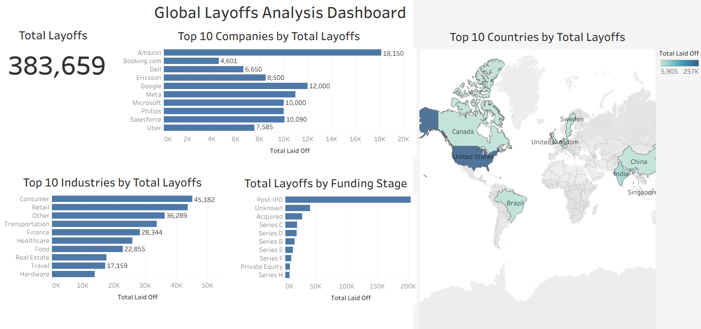

# World Layoffs Analysis

This project analyzes global layoffs data to uncover trends and patterns in workforce reductions across different industries, companies, countries, and time periods.

## Project Overview

The analysis explores global layoffs using **Python, MySQL, Tableau, and Power BI**. The project covers data cleaning, exploratory data analysis, SQL analysis, and interactive dashboard development.

The goal is to identify which companies, industries, countries, and funding stages were most affected by layoffs and to understand how layoffs changed over time.

## Tools & Technologies

* Python (Pandas, Matplotlib)
* MySQL
* Tableau
* Power BI
* GitHub

## Dashboard Preview

### Tableau Dashboard



### Power BI Dashboard


## Key Analysis Areas

* Layoffs by country
* Layoffs by company
* Layoffs by industry
* Layoffs by funding stage
* Layoff trends over time
* Comparison of global workforce reductions

## Key Findings

The analysis revealed several notable patterns in global layoffs:

* The **United States** accounted for the largest number of layoffs in the dataset.
* **Amazon, Google, and Meta** were among the companies with the highest recorded layoffs.
* The **Consumer** and **Retail** industries experienced significant workforce reductions.
* Layoffs varied considerably across different funding stages.
* The analysis showed clear changes in layoff activity across different time periods.

These findings were explored through SQL queries, Python-based exploratory data analysis, and interactive Tableau and Power BI dashboards.

## Data Preparation

The dataset was cleaned and prepared before analysis. The data preparation process included:

* Removing duplicate records
* Handling missing values
* Standardizing country and location values
* Converting date fields into the appropriate format
* Preparing the dataset for SQL analysis and visualization

## Project Structure

```text
world-layoffs-analysis/
│
├── Python/
│   └── world_layoffs_analysis.ipynb
│
├── SQL/
│   └── SQL analysis files
│
├── Tableau/
│   ├── world_layoffs_analysis_dashboard.twbx
│   └── world_layoffs_tableau_dashboard.png
│
├── Power BI/
│   ├── world_layoffs_analysis_power_bi.pbix
│   └── world_layoffs_power_bi_dashboard.png
│
├── LICENSE
└── README.md
